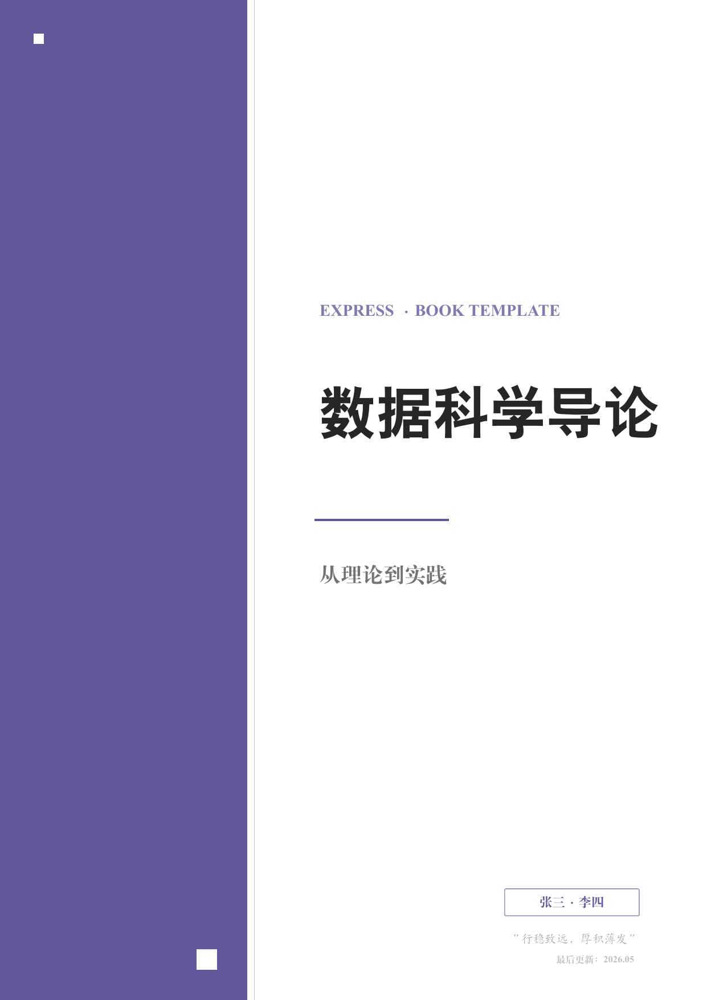

<div align="center">
  
</div>

<div align="center">
  
  
  </br>
  
  
  
</div>

<div align="center">
  <a href="https://exbook.github.io/express/">官方网站</a>
</div>

---

# 简介

**ExPress** 是一个专为书籍排版设计的 LaTeX 文档类。一次配置，即可生成专业排版的书籍 PDF。延续了 ExBook 的极简配置理念，同时新增书籍特有结构：篇/章/节、前言、附录、参考文献和边注。

<div align="center">
  
  &nbsp;
  
</div>

**功能特点：**

1. **现代极简封面**：侧面色块 + 大字标题，配色随 12 种主题色自动切换
2. **完整书籍结构**：篇（Part）/ 章（Chapter）/ 节（Section）三级层次，`book` 基类原生支持
3. **保留全部习题功能**：题目组、选择题自动排版、解析环境、小问列表，与 ExBook 完全兼容
4. **前言 / 附录 / 参考文献**：`preface`、`appendices`、`references` 三个环境，开箱即用
5. **边注（可选）**：`\mynote` 命令，一键开关，关闭时自动回退为脚注
6. **图/表按章编号**：主题色题注，格式 "Fig 2.1"
7. **页眉章节名随动**：`showmark` 选项开启后，偶数页章名，奇数页节名
8. **深色模式**：全局 `darkmode` 选项
9. **支持 A4 / B5**：文档类选项一键切换，封面和边距自动适配
10. **12 种颜色主题**：4 种经典 + 8 种 MBTI 个性色

---

# 快速开始

```bash
# 编译示例文档
latexmk main.tex

# 或直接使用 xelatex
xelatex main.tex

# 清理辅助文件
latexmk -c
```

---

# 文档类参考

## 文档类选项

| 选项 | 默认 | 说明 |
|------|------|------|
| `a4paper` / `b5paper` | a4paper | 纸张尺寸 |
| `adobe` / `ubuntu` / `mac` / `windows` / `fandol` | fandol | 中文字体集 |
| `printmode` | false | 双面打印 + 装订边距 |
| `online` | false | 封面显示勘误链接 |
| `water` | false | 每页右下角水印 |
| `darkmode` | false | 深色模式 |
| `notocnum` | false | 隐藏章节编号 |
| `showmark` | false | 页眉自动显示章节名 |
| `analysis` | false | 全局显示习题解析 |
| `marginnotes` | false | 启用边注 |

## 封面设置

打开 `config.tex`：

```latex
\CoverImg{}                          % 留空使用纯色块；填入路径使用封面图
\PreTitle{EXPRESS · BOOK TEMPLATE}   % 前置标题
\Title{数据科学导论}                   % 主标题
\Subtitle{从理论到实践}                % 副标题
\Author{张三 · 李四}                  % 作者
\Motto{行稳致远，厚积薄发}             % 座右铭
\UpdateTime{2026.05}                  % 日期
\OnlineCheckUrl{https://github.com/ExBook/ExPress}  % 勘误地址
```

## 主题颜色设置

```latex
% 经典色：\blue（默认） \green \purple \orange
% MBTI 色：\infj \enfp \infp \esfp \intj \entp \isfj \enfj
\setThemeColor{\blue}
```

## 其他设置

```latex
\setSolutionDisplay{\hideSolution}   % 答案显示：\showSolution / \hideSolution
\marginnotetoggle{off}               % 边注开关：on / off
\TextWater{[水印文字]}               % 文字水印
\WaterImg{img/water.png}             % 图片水印
```

---

# 环境与命令

## 书籍结构

| 环境 | 说明 |
|------|------|
| `preface` | 前言（无编号章节 + 加入目录） |
| `\part{...}` | 篇 |
| `\chapter{...}` | 章 |
| `\section{...}` | 节 |
| `\subsection{...}` | 子节 |
| `appendices` | 附录（章号重置为 A, B, C...） |
| `references` | 参考文献 |

## 习题系统

与 ExBook 完全兼容：

```latex
\begin{qitems}[showanalysis, prefix=（, suffix=）]
    \begin{bbox}
        \qitem 题目内容
        \fourchoices{A}{B}{C}{D}
        \begin{analysis}
            解析内容
        \end{analysis}
    \end{bbox}
\end{qitems}
```

选择题选项命令：`\threechoices`、`\fourchoices`、`\fivechoices`、`\sixchoices`。选项会根据文字长度自动排列为 1 列、2 列或 4 列。

小问环境：`subqitems` + `\subqitem`。

## 工具命令

| 命令 | 说明 |
|------|------|
| `\imgin[缩放]{对齐}{路径}` | 插入图片 |
| `\autotilte[对齐]{标题}{副标题}` | 自由标题 |
| `\blankbox` / `\eblankbox` | 中文/英文空括号 |
| `\blankline` | 空白下划线 |
| `\qanswerloc{页码}` | 答案位置指示 |
| `\textwater` | 渲染水印文字 |
| `\mynote{内容}` | 边注（开启时页边，关闭时脚注） |
| `\noreftitle{标题}` | 无索引标题 |
| `\hideheaderfooter` | 隐藏当前页页眉页脚 |

## 代码高亮

```latex
\begin{lstlisting}
int main() {
    return 0;
}
\end{lstlisting}
```

## 图/表题注

图/表按章自动编号，标签使用主题色：

```latex
\begin{figure}[htbp]
    \centering
    \imgin{}{fig/example.png}
    \caption{图释文字}
    \label{fig:example}
\end{figure}
```

---

# 完整示例

`main.tex`：

```latex
\documentclass[showmark, analysis]{ExPress}

\begin{document}

\include{config}
\maketitle

\begin{preface}
    前言内容...
\end{preface}

\tableofcontents

\part{第一部分}

\chapter{第一章}
\section{第一节}
正文内容...

\section{第二节：课后习题}
\begin{qitems}[showanalysis]
    \begin{bbox}
        \qitem 题目内容
        \fourchoices{A}{B}{C}{D}
        \begin{analysis}
            解析内容
        \end{analysis}
    \end{bbox}
\end{qitems}

\begin{appendices}
    \chapter{补充证明}
\end{appendices}

\begin{references}
    \bibitem{ref1} ...
\end{references}

\end{document}
```

---

# 项目结构

```
ExPress/
├── ExPress.cls            # 类文件
├── config.tex             # 用户配置
├── .latexmkrc             # 编译配置
├── main.tex               # 示例主文档
├── example/
│   └── chapters/
│       ├── ch01.tex       # 理论章
│       ├── ch01-ex.tex    # 习题章
│       └── appendix.tex   # 附录
├── img/                   # 图片
└── fig/                   # 正文插图
```

---

## 许可证

MIT License
